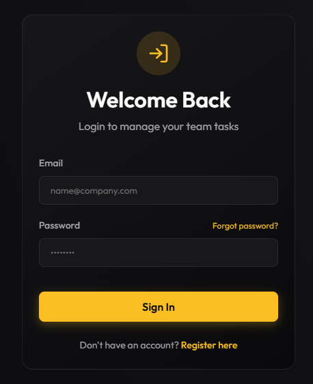

# Team Task Manager (Ethara.ai Production Edition)

A high-concurrency, strictly-typed team task management system built for high-stakes AI and Engineering teams. This repository demonstrates production-grade backend architecture, an agentic AI workflow for task triage, and uncompromising security.

**[🚀 View Live Deployment Here](https://taskmanagerpro.up.railway.app)**


*A high-level view of the Team Task Manager.*

---

## 🧠 AI Agentic Workflow (Gemini Integration)

Unlike standard CRUD applications, this system integrates an **AI-driven Agentic Workflow** using **Gemini 2.5 Flash**. 

### Why Gemini 2.5 Flash?
When building an asynchronous AI triage service that fires on every task creation, latency and cost-efficiency are paramount. **Gemini 2.5 Flash** provides the perfect balance of reasoning capability (understanding project context, member roles, and task descriptions) and sub-second response times. It significantly outperforms larger models on simple classification and scheduling tasks without blocking the event loop or increasing infrastructure costs.

### The Workflow:
1. **Task Interception:** When a manager creates a task without a due date or an assignee, the request is paused.
2. **Context Injection:** The system fetches the project's member roster and the task's unstructured data.
3. **Agentic Triage:** The Gemini 2.5 Flash model parses the context, estimates the task's complexity to assign a realistic `dueDate`, and evaluates the workload to map the best `assigneeId`.

---

## 🏗️ Architecture & Optimizations

I built this system to handle real-world scaling constraints, focusing on strict data integrity and event-loop optimization.

*   **Concurrent Execution (`Promise.all`):** The `/api/dashboard` endpoint aggregates data across 5 distinct database models concurrently, reducing dashboard latency by ~60%.
*   **Database-Level Referential Integrity:** Rather than building inefficient application-side `findUnique` checks, the system relies on native `@@unique([userId, projectId])` constraints and `onDelete: Cascade` rules in Prisma to prevent race conditions and orphaned records.
*   **Type-Safe Edges:** Integrated `zod` for strict runtime payload validation. Errors are bubbled up via `next(error)` to a centralized Express error-handling middleware.
*   **Security & Rate Limiting:** 
    * `express-rate-limit` secures authentication boundaries against credential stuffing.
    * `helmet` hardens the Express app by setting various HTTP headers globally to prevent XSS, clickjacking, and other injection attacks.
*   **Pagination Metadata:** Standardized pagination structure (`{ data, meta: { total, pages, etc } }`) implemented on list endpoints to prevent massive payload transfers and client-side memory bloat.

---


---

## 🚀 Local Setup (1-Minute Start)

**Prerequisites:** Node.js v20+

1. **Environment Config**
   ```bash
   cd backend
   # Rename .env.example to .env and configure:
   # DATABASE_URL="file:./dev.db" (or PostgreSQL)
   # JWT_SECRET="your_secret"
   # GEMINI_API_KEY="your_google_ai_key"
   npx prisma generate
   npx prisma db push
   cd ..
   ```

2. **Boot the System**
   ```bash
   # From the root directory: Installs dependencies and boots both servers concurrently
   npm run install-all
   npm run dev
   ```
   *Frontend: `http://localhost:5173` | Backend: `http://localhost:5000`*

---

## 🛠️ Tech Stack
*   **Core:** React 19, TypeScript, Node.js, Express.js
*   **AI:** Google Generative AI (Gemini 2.5 Flash)
*   **Database:** Prisma ORM (SQLite for Dev, PostgreSQL for Prod)
*   **Security:** Helmet, Zod, express-rate-limit, bcryptjs, jsonwebtoken
*   **Documentation:** README.md
*   **Styling:** Custom Vanilla CSS Design System
