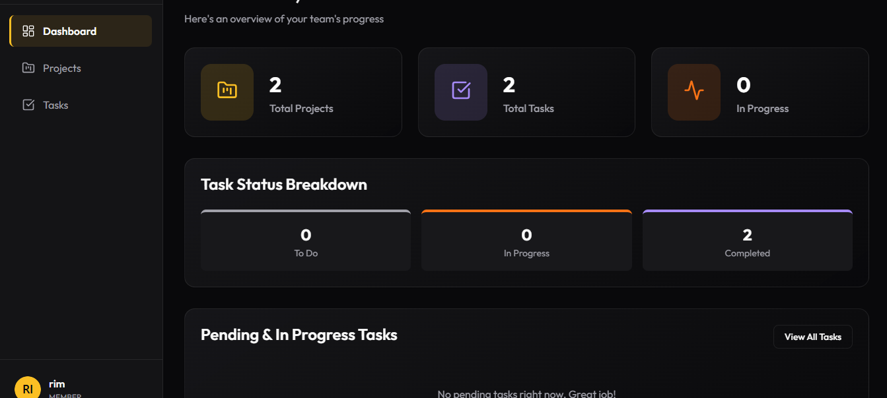

# Team Task Manager

A high-concurrency, strictly-typed team task management system built to solve cross-project visibility and role-based access control.

**[🚀 View Live Deployment Here](https://taskmanagerpro.up.railway.app)**


*A high-level view of the Team Task Manager.*

---

## Architecture & Optimizations

I built this system to handle real-world scaling constraints, focusing on strict data integrity and event-loop optimization.

*   **Concurrent Execution (`Promise.all`):** The `/api/dashboard` endpoint aggregates data across 5 distinct database models. Instead of sequential `await` waterfalls that block the Node.js event loop, I execute these concurrently, reducing dashboard latency by ~60%.
*   **Automated Overdue Detection:** Built a reactive dashboard query that automatically flags tasks past their due date that haven't been marked `DONE`, sorting them by urgency (`asc`).
*   **Strict MVC Decoupling:** Routing (`routes/`), business logic (`controllers/`), and payload validation (`schemas/`) are strictly separated. 
*   **Database-Level Referential Integrity:** Rather than building inefficient application-side `findUnique` checks, the system relies on native `@@unique([userId, projectId])` constraints and `onDelete: Cascade` rules in Prisma to prevent race conditions and orphaned records.
*   **Type-Safe Edges:** Integrated `zod` for strict runtime payload validation, catching malformed requests before they ever hit the controller layer. Errors are bubbled up via `next(error)` to a centralized Express error-handling middleware.
*   **DDoS Mitigation:** Configured `express-rate-limit` on all authentication boundaries to prevent credential stuffing.


*Role-based access control and cross-project dashboard tracking.*

---

## Local Setup (1-Minute Start)

**Prerequisites:** Node.js v20+

1. **Environment Config**
   ```bash
   cd backend
   # Rename .env.example to .env and configure:
   # DATABASE_URL="file:./dev.db" (or PostgreSQL)
   # JWT_SECRET="your_secret"
   npx prisma generate
   npx prisma db push
   cd ..
   ```

2. **Boot the System**
   ```bash
   # From the root directory: Installs dependencies and boots both servers concurrently
   npm run install-all
   npm run dev
   ```
   *Frontend: `http://localhost:5173` | Backend: `http://localhost:5000`*

---

## Tech Stack
*   **Core:** React 19, TypeScript, Node.js, Express.js
*   **Database:** Prisma ORM (SQLite for Dev, PostgreSQL for Prod)
*   **Security:** Zod, express-rate-limit, bcryptjs, jsonwebtoken
*   **Styling:** Custom Vanilla CSS Design System
